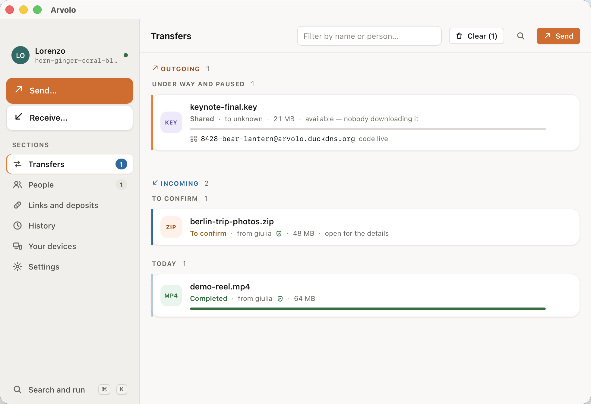

# Arvolo

*Read it in [English](README.md) · Lisez-le en [français](README.fr.md) ·
Lies es auf [Deutsch](README.de.md).*

**Manda file a chiunque — cifrati end-to-end, senza account, anche se il
destinatario è offline.**



Quando i due dispositivi sono online, i file viaggiano **peer-to-peer** — da una
macchina all'altra, mai attraverso un server. Quando il destinatario non c'è, il
file aspetta **sigillato** nella mailbox di un relay: un piccolo server **che
puoi ospitare tu**, che conserva solo testo cifrato e non può leggere nulla. E
per chi non ha installato niente, un **link** scarica e decifra il file in
qualsiasi browser.

- **Cifratura end-to-end, sempre** — le chiavi non toccano mai un server.
- **Niente account, nessun intermediario** — i tuoi file passano da
  infrastruttura che controlli tu.
- **Raggiunge chi è offline** — i depositi sigillati aspettano il destinatario,
  poi bruciano alla lettura.
- **App e riga di comando, un solo motore** — macOS (firmata e notarizzata),
  Windows e Linux.

## Provalo in due minuti

**1. Prendi Arvolo.** Scarica l'app dall'[ultima
release](https://github.com/lords82/arvolo/releases) — `.dmg` per macOS, `.msi`
per Windows, `.AppImage` per Linux — oppure installa il client da riga di
comando:

```sh
curl -fsSL https://raw.githubusercontent.com/lords82/arvolo/main/install.sh | sh
```

**2. Puntalo a un relay.** Arvolo non ha un server centrale — è proprio il
punto — quindi serve un relay: quello che la tua azienda o un amico già
gestisce, oppure il tuo, su in un comando:

```sh
docker run -d --name arvolo-relay -p 6282:6282 -v arvolo-data:/data \
  ghcr.io/lords82/arvolo-relay:latest
```

Nell'app lo imposti in **Impostazioni → Rete**; da riga di comando il primo
avvio te lo chiede e se lo ricorda.

**3. Manda qualcosa.** Nell'app: trascina un file nella finestra e condividi il
codice breve che ti dà — l'altra persona lo incolla nel suo Arvolo e il file
arriva. Stessa cosa dal terminale:

```sh
# tu
arvolo code ./foto.jpg
#   ->  4821-crater-mango

# l'altra persona
arvolo recv 4821-crater-mango
```

Dall'altra parte non c'è niente di installato? `arvolo link ./report.pdf`
stampa un URL che scarica e decifra in qualsiasi browser — senza installare,
senza account. Ecco cosa vede chi lo apre:


## Per proseguire

| | |
|---|---|
| [Il manuale](docs/MANUAL.md) | Ogni comando, ogni flag, ogni impostazione — e come funziona dentro. *(inglese)* |
| [Quickstart](docs/QUICKSTART.md) | Mettere su un relay per bene, in LAN e dietro nginx + TLS. *(inglese)* |
| [Deploy](docs/DEPLOY.md) | Self-hosting in produzione: systemd, Docker, hardening. *(inglese)* |
| [L'app desktop](gui/README.md) | La GUI in dettaglio, con la tabella di parità con la CLI. *(inglese)* |
| [Il protocollo](docs/PROTOCOL.md) | Il formato di rete e ogni flusso, per curiosi e auditor. *(inglese)* |

## Licenza

Open core: client e relay sono software libero sotto
[AGPL-3.0-only](LICENSE); una licenza commerciale separata copre l'uso
proprietario e le funzioni business. "Arvolo" è un marchio del proprietario del
progetto — vedi [CONTRIBUTING.md](CONTRIBUTING.md).
